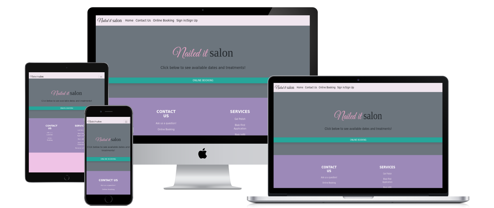
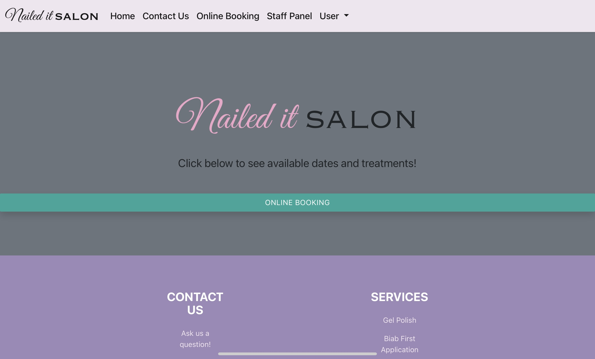

# Nail Salon



The nail salon website is an appointment managing website for the fictitious salon "nailed it" where users can book,edit, update and delete appointments and staff members can view appointments. This website was built using the Django python framework.

Customers are also able to send a form directly to the website which is stored and readable for staff on the administration page.

The live link can be found here - https://nail-salon-booking.herokuapp.com

## Features

### Existing Features

- Landing Page
    - On the landing page, new users will see this nav bar. allowing them to access the contact page, booking or sign in/sign up.


    - When a regular customer signs in they will see this version of the nav bar, the user option will give them a drop down menu that allows them to access the user panel or logout.


    -The full landing page and nav bar that staff members will see is shown below. The booking button will take users to the online booking feature.


    - The code that changes this view is in the layout.html template:
```                     
                        
                        
                        <!--Staff Link-->
                        <li class="nav-item">
                            <a class="nav-link active cHover" href="">Staff Panel</a>
                        </li>
                        
                        <li class="nav-item dropdown me-3 fs-5">
                            <a class="nav-link active dropdown-toggle cHover" href="#" role="button"
                                data-bs-toggle="dropdown" aria-expanded="false">
                                User
                            </a>
                            <ul class="dropdown-menu  border zNav" style="background-color: #F0E6EF;">
                                <li><a class="dropdown-item" href="">User Panel</a></li>
                                <li>
                                    <hr class="">
                                </li>
                                <li><a class="dropdown-item" href="?next=/">Sign Out</a></li>
                            </ul>
                        </li>
                        
                        <li class="nav-item me-3">
                            <a class="nav-link active cHover" href="">Sign in/Sign Up</a>
                        </li>
                        

```
- Combat
    - In some rooms there are enemies that will take the player's HP and the player will have to either attack and kill the enemy or flee
        - Currently the only implemented enemy is the giant spider.


- Finding Loot
    - the player is able to find different kind of items in the dungeon and add them to their inventory
        -currently implemented is the ability to find a dagger which does more damage than the default rock
    - The player is also able to find gold which updates their total gold amount


- Winning and losing the game
    - The player is able to win the game by finding the room that is the exit to the cave


- Gathering feedback data from Player
    - When the player enters a command that isn't on the list of available actions they are told that their input is invalid. They are then asked what they were trying to do.
    The input and the explanation are then dat and timestamped and sent to a google sheet where the developer can see this information. The intent behind this is that there are many different ways of giving a similar command (eg. 'Move North', 'Go North', 'North' etc...) so this way the developer can easily copy in words player are trying to use for available commands into action's keywords. The developer can also use inputs that were trying to do actions that arn't in the game as inspiration to add features that player's want.


### Future Features

- Staff CRUD
    - A useful feature for future implementation would be allowing staff members to edit and delete appointments form the staff panel

- Multiple calenders
    - If the salon had multiple technicians then the appointment calender would need to be changed so that each technician had their own calenders that customers could select from

- E-mail Reminders
    - A useful feature to implement would be to have an automated email be sent to customers reminding them of their appointment.

## Data Model

- The website is made up of two apps. The authentication app handles user registration and sign-in/out. The book app handles the creation and management of appointments.

### Authentication

### Booking

## Testing

### Validator Testing

- Html
    - Using w3 validator templates were passing ignoring Django html template syntax
    - https://validator.w3.org/nu/

### Compatibility Testing

Site was tested across multiple virtual devices through chrome developor tools.

Site was tested to work on Google chrome, firefox, microsoft edge and internet explorer.

## Deployment

- The site was deployed using Code Institute's mock terminal for Heorku. The steps to deploy are as follows
    - Create a new Heroku App
    - Set the buildbacks to Python and NodeJS in that order
    - Link the heroku app to a PostgreSQL database hosted on https://www.elephantsql.com
    - Link the heroku app to the repository
    - Click on Deploy

## Credits

- To complete this project I used Code Institute student template: [gitpod full template](https://github.com/Code-Institute-Org/python-essentials-template)

- Bootstrap framework was used to help write the html and css in the templates.

### Code

- Tutorials I followed to create the basis of this code are as follows:
    -https://www.thetechplatform.com/post/develop-an-hotel-management-system-with-django
- https://www.google.co.uk/url?sa=t&rct=j&q=&esrc=s&source=web&cd=&ved=2ahUKEwiMw-7868r7AhVjxDgGHUkHC98QwqsBegQIChAF&url=https%3A%2F%2Fwww.youtube.com%2Fwatch%3Fv%3DrHZwE1AK1h8&usg=AOvVaw3cyttpzMTyD7QJFg-lzosP
- https://blog.devgenius.io/django-tutorial-on-how-to-create-a-booking-system-for-a-health-clinic-9b1920fc2b78

